# Enterprise-Grade Architecture Overview

This document provides a comprehensive overview of the vergo automation platform's enterprise-grade architecture, design decisions, and core workflows built on a robust Puppeteer-first stack.

## 🏗️ High-Level Architecture

### Core Philosophy
**Enterprise-Grade Puppeteer-First Architecture** - The entire platform is designed around enterprise-grade browser automation with advanced workflow orchestration, secure login management, and intelligent execution engines.

```
┌─────────────────┐    ┌─────────────────┐    ┌─────────────────┐
│   Frontend      │    │   Backend       │    │   Automation    │
│   (Next.js)     │    │   (API Routes)  │    │   Engine        │
├─────────────────┤    ├─────────────────┤    ├─────────────────┤
│ • Workflow UI   │◄──►│ • Workflow API  │◄──►│ • Puppeteer     │
│ • Login UI      │    │ • Auth API      │    │ • LoginAgent    │
│ • Dashboard     │    │ • Queue System  │    │ • LogicCompiler │
│ • Scheduler UI  │    │ • Scheduler     │    │ • AgentRunner   │
└─────────────────┘    └─────────────────┘    └─────────────────┘
                              │
                              ▼
                    ┌─────────────────┐
                    │   Database      │
                    │   (Prisma)      │
                    ├─────────────────┤
                    │ • Workflows     │
                    │ • Actions       │
                    │ • Runs/Steps    │
                    │ • Variables     │
                    │ • Schedules     │
                    │ • Logins        │
                    └─────────────────┘
```

## 🎬 Enterprise-Grade Capture System

### **PuppeteerCaptureService Architecture**


### **Multi-Signal Capture**
- **DOM Metadata**: Element selectors, attributes, and context
- **Visual Context**: Screenshots at key workflow moments
- **Action Recording**: User interactions with precise timing
- **Login Integration**: Secure credential capture and session management

### **Selector Strategy**
- **Priority-based selection**: ID → data-testid → name → role → class → nth-child
- **Fallback mechanisms**: Multiple selector strategies per element
- **Context awareness**: Element relationships and page state
- **Self-healing**: Automatic selector repair on failures

## 🔄 Enterprise Replay Engine

### **PuppeteerReplayService Architecture**


### **Execution Features**
- **Intelligent Timing**: Wait policies for dynamic content
- **Retry Mechanisms**: Automatic failure recovery
- **Visual Feedback**: Element highlighting during execution
- **Error Handling**: Comprehensive error capture and reporting

## 🧠 Logic Compiler System

### **Natural Language Processing**


### **Rule Engine Features**
- **Conditional Logic**: If-then-else statements and complex conditions
- **Loop Processing**: For-each and while loops with context
- **Variable Handling**: Dynamic variable injection and validation
- **Error Validation**: Comprehensive logic specification validation

## 🏃 Agent Runner System

### **Enterprise Execution Engine**


### **Execution Features**
- **Enterprise-grade reliability**: Production-ready execution
- **LoginAgentAdapter integration**: Secure authentication handling
- **Real-time monitoring**: Execution tracking and performance metrics
- **Screenshot capture**: Visual debugging and audit trails

## 🔐 LoginAgentAdapter System

### **Universal Login Support**


### **Login Features**
- **Universal detection**: Automatic login form detection
- **Session management**: Secure credential storage and reuse
- **2FA support**: Multi-factor authentication integration
- **Health monitoring**: Proactive login status validation

## ⏰ Advanced Scheduler

### **Workflow Orchestration**

```mermaid
graph TD
    A[Schedule Request] --> B[Scheduler]
    B --> C[Cron Engine]
    B --> D[Queue Management]
    B --> E[Event Processing]
    
    C --> F[Time-based Triggers]
    D --> G[Job Queuing]
    E --> H[Event Triggers]
    
    F --> I[Execution Trigger]
    G --> I
    H --> I
    
    I --> J[Workflow Execution]
    J --> K[Result Processing]
```


### **Scheduling Features**
- **Cron expressions**: Flexible time-based scheduling
- **Event-driven**: Trigger workflows based on external events
- **Queue management**: Background job processing
- **Retry policies**: Configurable failure recovery

## 📊 Database Architecture

### **Enterprise Workflow Models**

#### **Workflow Core**
```typescript
model Workflow {
  id            String        @id @default(cuid())
  name          String
  description   String?
  status        WorkflowStatus @default(DRAFT)
  version       String        @default("1.0.0")
  requiresLogin Boolean       @default(false)
  loginConfig   Json?         // Encrypted LoginConfig JSON
  logicSpec     Json          // LogicSpec JSON
  metadata      Json?         // Additional metadata
  ownerId       String
  createdAt     DateTime      @default(now())
  updatedAt     DateTime      @updatedAt
  
  // Relations
  actions       WorkflowAction[]
  variables     WorkflowVariable[]
  runs          WorkflowRun[]
  schedules     WorkflowSchedule[]
  owner         User          @relation(fields: [ownerId], references: [id])
}
```

#### **Action System**
```typescript
model WorkflowAction {
  id         String   @id @default(cuid())
  workflowId String
  action     Json     // Action JSON with metadata
  order      Int
  createdAt  DateTime @default(now())
  updatedAt  DateTime @updatedAt
  
  workflow   Workflow @relation(fields: [workflowId], references: [id])
}
```

#### **Variable System**
```typescript
model WorkflowVariable {
  id         String   @id @default(cuid())
  workflowId String
  variable   Json     // VariableDef JSON
  createdAt  DateTime @default(now())
  updatedAt  DateTime @updatedAt
  
  workflow   Workflow @relation(fields: [workflowId], references: [id])
}
```

#### **Execution Tracking**
```typescript
model WorkflowRun {
  id         String        @id @default(cuid())
  workflowId String
  status     RunStepStatus @default(PENDING)
  startedAt  DateTime      @default(now())
  finishedAt DateTime?
  variables  Json?         // Variables used in this run
  result     Json?         // Run result
  error      String?       // Error message if failed
  logs       Json?         // Array of RunLog JSON
  metadata   Json?         // Additional metadata
  
  workflow   Workflow      @relation(fields: [workflowId], references: [id])
  steps      WorkflowRunStep[]
}

model WorkflowRunStep {
  id         String        @id @default(cuid())
  runId      String
  actionId   String
  status     RunStepStatus @default(PENDING)
  startedAt  DateTime      @default(now())
  finishedAt DateTime?
  result     Json?         // Step result
  error      String?       // Error message if failed
  logs       Json?         // Array of RunLog JSON
  metadata   Json?         // Additional metadata
  
  run        WorkflowRun   @relation(fields: [runId], references: [id])
}
```

#### **Scheduling System**
```typescript
model WorkflowSchedule {
  id         String   @id @default(cuid())
  workflowId String
  schedule   Json     // Schedule configuration
  enabled    Boolean  @default(true)
  createdAt  DateTime @default(now())
  updatedAt  DateTime @updatedAt
  
  workflow   Workflow @relation(fields: [workflowId], references: [id])
}
```

### **Legacy Agent Models** (Maintained for compatibility)
- **Agent**: Traditional agent definitions
- **Login**: Secure credential storage
- **AgentRun**: Execution history and results
- **Event**: Detailed action logging

## 🔄 Core Workflows

### **1. Enterprise Workflow Creation**


### **2. Logic Compilation**


### **3. Enterprise Execution**


### **4. Advanced Scheduling**


## 🛠️ Technology Stack

### **Frontend**
- **Next.js 15** - React framework with App Router
- **React 19** - Latest React with concurrent features
- **TypeScript** - Full type safety and IntelliSense
- **Custom CSS** - Optimized styling without external frameworks

### **Backend**
- **Next.js API Routes** - Serverless API endpoints
- **Prisma** - Type-safe database ORM
- **NextAuth.js** - Authentication and session management
- **Zod** - Runtime type validation

### **Automation Engine**
- **Puppeteer** - Enterprise-grade browser automation
- **LoginAgentAdapter** - Universal login integration
- **LogicCompiler** - Natural language rule processing
- **AgentRunner** - Production-ready execution engine

### **Infrastructure**
- **SQLite** - Development database
- **PostgreSQL** - Production database
- **Redis** - Queue processing and caching
- **Docker** - Containerized deployment

## 🔐 Security Architecture

### **Authentication Flow**


### **Credential Encryption**
- **AES-256 encryption** for stored passwords
- **Environment-based keys** for encryption
- **Session-based decryption** for runtime use
- **No plaintext storage** of sensitive data

### **API Security**
- **JWT-based authentication** via NextAuth.js
- **Route-level protection** for sensitive endpoints
- **Input validation** with Zod schemas
- **Rate limiting** on API endpoints

## 🚀 Performance Considerations

### **Optimization Strategies**
- **Server-side rendering** for initial page loads
- **Client-side hydration** for interactivity
- **Database indexing** on frequently queried fields
- **Queue-based processing** for long-running tasks
- **Caching** for frequently accessed data

### **Scalability**
- **Stateless API design** for horizontal scaling
- **Database connection pooling** via Prisma
- **Queue-based job processing** for background tasks
- **CDN-ready static assets** via Next.js

## 🔄 Development Workflow

### **Local Development**
```bash
# Start development server
npm run dev

# Run tests
npm run test

# Type checking
npm run type-check

# Database operations
npx prisma studio
npx prisma generate
```

### **Testing Strategy**
```bash
# Unit tests
npm test -- tests/agents/capture/
npm test -- tests/agents/exec/
npm test -- tests/agents/login/

# Integration tests
./scripts/run-integration-tests.sh

# E2E tests
npm test -- tests/integration/WorkflowIntegration.test.ts
```

## 📈 Monitoring & Observability

### **Logging Strategy**
- **Structured logging** with consistent format
- **Error tracking** with stack traces
- **Performance metrics** for key operations
- **User action tracking** for analytics

### **Health Checks**
- **Database connectivity** monitoring
- **External service** availability
- **Queue processing** status
- **Authentication service** health

## 🔮 Future Considerations

### **Planned Enhancements**
- **Multi-tenant support** for enterprise use
- **Advanced scheduling** with complex cron expressions
- **Plugin system** for custom actions
- **Analytics dashboard** for usage insights
- **API rate limiting** and usage quotas

### **Scalability Roadmap**
- **Microservices architecture** for large deployments
- **Event-driven architecture** for real-time updates
- **Distributed queue processing** for high throughput
- **Multi-region deployment** for global availability

---

**Architecture Principles:**
1. **Enterprise-grade reliability** - Production-ready automation
2. **Type safety** - Leverage TypeScript for runtime safety
3. **Self-healing** - Build resilience into core workflows
4. **Security first** - Protect user data and credentials
5. **Developer experience** - Make development and testing easy
6. **Scalability** - Design for enterprise-scale operations