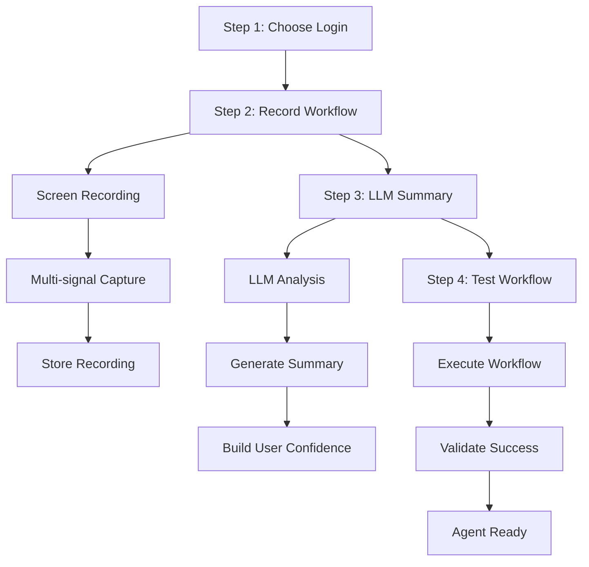
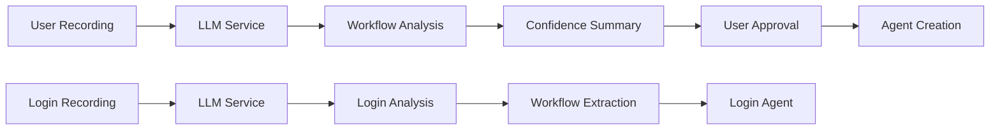

# Architecture Overview

This document provides a comprehensive overview of the vergo automation platform architecture, design decisions, and core workflows.

## 🏗️ High-Level Architecture

### Core Philosophy
**Agents-First Architecture** - The entire platform is designed around intelligent agents that can automate complex workflows with self-healing capabilities.

```
┌─────────────────┐    ┌─────────────────┐    ┌─────────────────┐
│   Frontend      │    │   Backend       │    │   External      │
│   (Next.js)     │    │   (API Routes)  │    │   Services      │
├─────────────────┤    ├─────────────────┤    ├─────────────────┤
│ • Agent UI      │◄──►│ • Agent API     │◄──►│ • LLM (OpenAI)  │
│ • Login UI      │    │ • Auth API      │    │ • Puppeteer     │
│ • Dashboard     │    │ • Queue System  │    │ • Redis         │
└─────────────────┘    └─────────────────┘    └─────────────────┘
                              │
                              ▼
                    ┌─────────────────┐
                    │   Database      │
                    │   (Prisma)      │
                    ├─────────────────┤
                    │ • Agents        │
                    │ • Logins        │
                    │ • Runs          │
                    │ • Users         │
                    └─────────────────┘
```

## 🧠 LLM Integration Architecture

### **New 4-Step Agent Creation with LLM**


### **LLM Service Integration**


**Key LLM Methods:**
- `summarizeWorkflow()` - Generates user-friendly workflow summaries
- `analyzeRecording()` - Extracts login workflows from recordings
- `annotateWorkflow()` - Adds intent annotations to agent steps
- `repairSelector()` - Self-healing selector repair

## 🔄 Core Workflows

### 1. **Create Agent** (Multi-Signal Recording + Processing)


**Key Components:**
- **Multi-Signal Capture**: URLs, keystrokes, element types, text content, screenshots
- **DOM Capture**: Rich metadata extraction (selectors, timestamps, context)
- **Visual Context**: Screenshot capture at key workflow moments
- **Event Storage**: Scalable Event table for large datasets
- **LLM Processing**: Intent generation with visual context
- **Agent Storage**: Configuration, intents, and event data in database

### 2. **Run Agent** (Two-Stage Execution)


**Execution Stages:**
1. **Primary Automation**: Execute recorded workflow as-is
2. **LLM Fallback**: If selectors fail, use LLM to repair and retry
3. **Self-Healing**: Automatic selector repair based on DOM changes

### 3. **Login Management** (Vault + Reconnect)


**Security Features:**
- **Encrypted Storage**: Credentials encrypted at rest
- **Session Management**: Automatic session validation
- **Reconnection Flow**: Seamless re-authentication
- **Health Monitoring**: Proactive login status checking

## 📊 Event System Architecture

### Multi-Signal Event Capture
The platform now supports enriched event logs with multi-signal capture for better automation context:


### Event Data Structure
```typescript
interface EventLogEntry {
  step: number;                    // Sequential step number
  action: 'navigate' | 'click' | 'type' | 'wait' | 'scroll' | 'hover' | 'select';
  target?: string;                 // CSS selector or element identifier
  value?: string;                  // Input value (excludes passwords)
  url?: string;                    // Current page URL
  elementType?: string;            // HTML element type
  elementText?: string;            // Text content of element
  screenshotUrl?: string;          // Reference to stored screenshot
  timestamp: number;               // Unix timestamp
}
```

### Storage Strategy
- **Event Table**: Scalable storage for large event datasets with indexed queries
- **JSON Storage**: Legacy `eventLog` field for simple event arrays
- **Screenshot Storage**: File system storage in `/uploads/events/` with URL references
- **Security**: Password values automatically excluded, file validation enforced

### API Endpoints
- **POST /api/agents/record-events**: Create agent with enriched event logs
- **GET /api/agents/[id]/review**: Retrieve agent with event data and screenshots
- **POST /api/agents/[id]/summarize**: Enhanced summarization with visual context

## 🛠️ Technology Stack

### Frontend
- **Next.js 15** - React framework with App Router
- **React 19** - Latest React with concurrent features
- **Inline CSS** - No external CSS frameworks for simplicity
- **TypeScript** - Type-safe development

### Backend
- **Next.js API Routes** - Serverless API endpoints
- **Prisma** - Type-safe database ORM
- **NextAuth.js** - Authentication and session management
- **Zod** - Runtime type validation

### Database
- **SQLite** - Development and testing
- **PostgreSQL** - Production (via Prisma)
- **Prisma Client** - Generated type-safe database client

### Queue System
- **Redis** - Queue storage and job management
- **BullMQ** - Job queue processing
- **In-memory fallback** - Development without Redis

### External Services
- **OpenAI API** - LLM for intent generation and repair
- **Puppeteer** - Browser automation and DOM capture
- **Jest** - Testing framework

## 🧠 Self-Healing Workflow

### Metadata-Rich Capture
```typescript
interface ActionMetadata {
  selector: string;           // Primary selector
  tag: string;               // HTML tag name
  timestamp: number;         // When action occurred
  intent?: string;           // User intent (LLM generated)
  type?: string;             // Input type (text, button, etc.)
  innerText?: string;        // Visible text content
  ariaLabel?: string;        // Accessibility label
  placeholder?: string;      // Input placeholder
}
```

### LLM Intent Repair
```typescript
interface RepairResult {
  selector: string;          // Repaired selector
  confidence: number;        // Confidence score (0-1)
  reasoning: string;         // Explanation of repair
}
```

### Repair Process
1. **Selector Failure Detection**: Monitor for element not found errors
2. **DOM Analysis**: Capture current page state
3. **LLM Processing**: Generate alternative selectors
4. **Confidence Scoring**: Rate repair quality
5. **Retry Execution**: Attempt with repaired selector

## 📊 Data Models

### Agent Schema
```typescript
model Agent {
  id              String   @id @default(cuid())
  name            String
  description     String?
  purposePrompt   String   // User's intent description
  agentConfig     String?  // JSON: Recorded workflow steps
  agentIntents    String?  // JSON: LLM-generated intents
  status          AgentStatus
  processingStatus String
  processingProgress Int
  ownerId         String
  owner           User     @relation(fields: [ownerId], references: [id])
  agentRuns       AgentRun[]
  createdAt       DateTime @default(now())
  updatedAt       DateTime @updatedAt
}
```

### Login Schema
```typescript
model Login {
  id              String   @id @default(cuid())
  name            String
  loginUrl        String
  username        String
  password        String   // Encrypted
  testOnCreate    Boolean  @default(true)
  ownerId         String
  owner           User     @relation(fields: [ownerId], references: [id])
  healthResults   LoginHealth[]
  createdAt       DateTime @default(now())
  updatedAt       DateTime @updatedAt
}
```

### Agent Run Schema
```typescript
model AgentRun {
  id              String   @id @default(cuid())
  agentId         String
  agent           Agent    @relation(fields: [agentId], references: [id])
  status          RunStatus
  result          String?
  logs            String?  // JSON: Execution logs
  startedAt       DateTime @default(now())
  finishedAt      DateTime?
  screenshot      String?  // Base64 screenshot
  error           String?
  userFeedback    String?
  createdAt       DateTime @default(now())
  updatedAt       DateTime @updatedAt
}
```

## 🚀 New API Endpoints (LLM Integration)

### **Agent Creation & LLM Processing**
```typescript
// 4-Step Agent Creation
POST /api/agents/record
- Creates agent with login association
- Handles multipart form data with recording
- Associates selected login with agent

POST /api/agents/[id]/summarize-workflow
- Generates AI summary of recorded workflow
- Builds user confidence with structured output
- Returns user-friendly workflow description

POST /api/agents/[id]/test-workflow
- Executes agent workflow in test mode
- Validates automation works correctly
- Returns success/failure with details
```

### **Login Recording & AI Analysis**
```typescript
POST /api/logins
- Enhanced to handle multipart form data
- Accepts screen recordings with login credentials
- Triggers automatic LLM analysis

POST /api/logins/[id]/analyze
- AI analysis of login recording
- Extracts workflow steps and selectors
- Generates login automation workflow
- Stores analysis in customConfig field
```

### **LLM Service Methods**
```typescript
class LLMService {
  // New method for workflow summarization
  async summarizeWorkflow(recordedSteps: any[], transcript?: string): Promise<string>
  
  // Enhanced login analysis
  async analyzeRecording(recordingUrl: string, prompt: string): Promise<string>
  
  // Existing methods
  async annotateWorkflow(recordedSteps: AgentConfig, userPrompt: string): Promise<AgentIntents>
  async repairSelector(failedSelector: string, intent: string, domSnapshot: string): Promise<RepairResult>
}
```

## 🔐 Security Architecture

### Authentication Flow


### Credential Encryption
- **AES-256 encryption** for stored passwords
- **Environment-based keys** for encryption
- **Session-based decryption** for runtime use
- **No plaintext storage** of sensitive data

### API Security
- **JWT-based authentication** via NextAuth.js
- **Route-level protection** for sensitive endpoints
- **Input validation** with Zod schemas
- **Rate limiting** on API endpoints

## 🚀 Performance Considerations

### Optimization Strategies
- **Server-side rendering** for initial page loads
- **Client-side hydration** for interactivity
- **Database indexing** on frequently queried fields
- **Queue-based processing** for long-running tasks
- **Caching** for frequently accessed data

### Scalability
- **Stateless API design** for horizontal scaling
- **Database connection pooling** via Prisma
- **Queue-based job processing** for background tasks
- **CDN-ready static assets** via Next.js

## 🔄 Development Workflow

### Local Development
```bash
# Start development server
npm run dev

# Run tests
npm run test

# Type checking
npm run type-check

# Database operations
npx prisma studio
npx prisma generate
```

### Deployment
```bash
# Build for production
npm run build

# Start production server
npm run start

# Database migrations
npx prisma migrate deploy
```

## 📈 Monitoring & Observability

### Logging Strategy
- **Structured logging** with consistent format
- **Error tracking** with stack traces
- **Performance metrics** for key operations
- **User action tracking** for analytics

### Health Checks
- **Database connectivity** monitoring
- **External service** availability
- **Queue processing** status
- **Authentication service** health

## 🔮 Future Considerations

### Planned Enhancements
- **Multi-tenant support** for enterprise use
- **Advanced scheduling** for recurring agents
- **Plugin system** for custom actions
- **Analytics dashboard** for usage insights
- **API rate limiting** and usage quotas

### Scalability Roadmap
- **Microservices architecture** for large deployments
- **Event-driven architecture** for real-time updates
- **Distributed queue processing** for high throughput
- **Multi-region deployment** for global availability

---

**Architecture Principles:**
1. **Simplicity over complexity** - Prefer simple, maintainable solutions
2. **Type safety** - Leverage TypeScript for runtime safety
3. **Self-healing** - Build resilience into core workflows
4. **Security first** - Protect user data and credentials
5. **Developer experience** - Make development and testing easy
